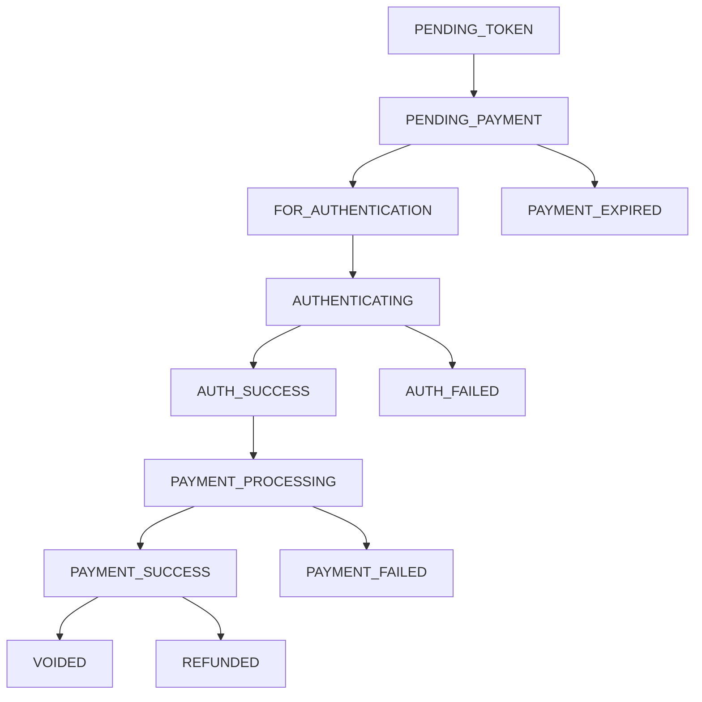

## Overview

The PayMaya SDK provides the `checkPaymentStatus()` method to manually verify the status of a payment transaction. This is useful for reconciliation, handling edge cases, or verifying payments after activity results.

<Info>
The SDK automatically checks payment status when users close the payment activity. Manual checking is typically needed for reconciliation or error recovery.
</Info>

## CheckPaymentStatusResult

The status check returns one of three result types:

```kotlin CheckPaymentStatusResult.kt
sealed class CheckPaymentStatusResult {

    /**
     * Checking payment status succeeded.
     *
     * @property status Payment status.
     */
    class Success internal constructor(
        val status: PaymentStatus
    ) : CheckPaymentStatusResult()

    /**
     * Checking payment status canceled.
     */
    object Cancel : CheckPaymentStatusResult()

    /**
     * Checking payment status failed.
     *
     * @property exception Exception with detailed reason of the failure.
     */
    class Failure internal constructor(
        val exception: Exception
    ) : CheckPaymentStatusResult()
}
```

## PaymentStatus Enum

The `PaymentStatus` enum defines all possible payment states:

```kotlin PaymentStatus.kt
enum class PaymentStatus {

    /**
     * Token is pending
     */
    PENDING_TOKEN,

    /**
     * Initial payment status of the checkout transaction
     */
    PENDING_PAYMENT,

    /**
     * When payment transaction is not executed and expiration time has been reached.
     */
    PAYMENT_EXPIRED,

    /**
     * When payment transaction is waiting for authentication.
     */
    FOR_AUTHENTICATION,

    /**
     * When payment transaction is currently authenticating.
     */
    AUTHENTICATING,

    /**
     * When authentication has been successfully executed.
     * Authentication may be in the form of 3DS authentication for card transactions.
     */
    AUTH_SUCCESS,

    /**
     * When authentication of payment has failed.
     */
    AUTH_FAILED,

    /**
     * When payment is processing.
     */
    PAYMENT_PROCESSING,

    /**
     * When payment is successfully processed.
     */
    PAYMENT_SUCCESS,

    /**
     * When payment is not successfully processed.
     */
    PAYMENT_FAILED,

    /**
     * When a successfully processed payment has been reversed
     * (usually before a settlement cut-off for card-based payments).
     */
    VOIDED,

    /**
     * When a successfully processed payment has been fully or partially reversed
     * (usually after a settlement cut-off for card-based payments).
     */
    REFUNDED
}
```

## Payment Status Flow

Understanding the typical flow of payment statuses:



## Using checkPaymentStatus()

<Warning>
**Important:** The `checkPaymentStatus()` method is synchronous and performs a network request. Always call it from a background thread, not the main UI thread.
</Warning>

### Basic Usage

```kotlin
import kotlinx.coroutines.*

// Check Checkout payment status
viewModelScope.launch(Dispatchers.IO) {
    val result = payMayaCheckoutClient.checkPaymentStatus(checkoutId)
    
    withContext(Dispatchers.Main) {
        handleStatusResult(result)
    }
}

private fun handleStatusResult(result: CheckPaymentStatusResult) {
    when (result) {
        is CheckPaymentStatusResult.Success -> {
            Log.d(TAG, "Payment status: ${result.status}")
            updateUIBasedOnStatus(result.status)
        }
        
        is CheckPaymentStatusResult.Cancel -> {
            Log.d(TAG, "Status check canceled")
        }
        
        is CheckPaymentStatusResult.Failure -> {
            Log.e(TAG, "Status check failed: ${result.exception.message}")
            showError("Could not retrieve payment status")
        }
    }
}
```

### With Different Payment Types

<CodeGroup>

```kotlin Checkout
fun checkCheckoutStatus(checkoutId: String) {
    lifecycleScope.launch(Dispatchers.IO) {
        val result = payMayaCheckoutClient.checkPaymentStatus(checkoutId)
        
        withContext(Dispatchers.Main) {
            when (result) {
                is CheckPaymentStatusResult.Success -> {
                    processCheckoutStatus(checkoutId, result.status)
                }
                is CheckPaymentStatusResult.Failure -> {
                    Log.e(TAG, "Failed to check status", result.exception)
                }
                else -> { /* Handle cancel */ }
            }
        }
    }
}
```

```kotlin Pay With PayMaya
fun checkPaymentStatus(paymentId: String) {
    lifecycleScope.launch(Dispatchers.IO) {
        val result = payWithPayMayaClient.checkPaymentStatus(paymentId)
        
        withContext(Dispatchers.Main) {
            when (result) {
                is CheckPaymentStatusResult.Success -> {
                    processSinglePaymentStatus(paymentId, result.status)
                }
                is CheckPaymentStatusResult.Failure -> {
                    Log.e(TAG, "Status check error", result.exception)
                }
                else -> { /* Handle cancel */ }
            }
        }
    }
}
```

</CodeGroup>

## Handling Payment Statuses

### Complete Status Handler

```kotlin
private fun updateUIBasedOnStatus(status: PaymentStatus) {
    when (status) {
        PaymentStatus.PAYMENT_SUCCESS -> {
            showSuccessScreen()
            markOrderAsCompleted()
        }
        
        PaymentStatus.PAYMENT_FAILED -> {
            showFailureScreen("Payment was declined")
            allowRetry()
        }
        
        PaymentStatus.AUTH_FAILED -> {
            showFailureScreen("Authentication failed")
            allowRetry()
        }
        
        PaymentStatus.PAYMENT_EXPIRED -> {
            showExpiredScreen()
            createNewPayment()
        }
        
        PaymentStatus.PENDING_PAYMENT,
        PaymentStatus.PENDING_TOKEN -> {
            showLoadingScreen("Payment is being processed...")
            scheduleStatusRecheck()
        }
        
        PaymentStatus.FOR_AUTHENTICATION,
        PaymentStatus.AUTHENTICATING -> {
            showLoadingScreen("Authenticating payment...")
            scheduleStatusRecheck()
        }
        
        PaymentStatus.AUTH_SUCCESS,
        PaymentStatus.PAYMENT_PROCESSING -> {
            showLoadingScreen("Processing payment...")
            scheduleStatusRecheck()
        }
        
        PaymentStatus.VOIDED -> {
            showVoidedScreen()
            updateOrderStatus("VOIDED")
        }
        
        PaymentStatus.REFUNDED -> {
            showRefundedScreen()
            updateOrderStatus("REFUNDED")
        }
    }
}
```

### Polling for Status Updates

For pending payments, you may need to poll for status updates:

```kotlin
private var statusCheckJob: Job? = null

fun startPollingStatus(paymentId: String) {
    statusCheckJob?.cancel()
    
    statusCheckJob = lifecycleScope.launch(Dispatchers.IO) {
        var attempts = 0
        val maxAttempts = 10
        val delayMs = 3000L
        
        while (attempts < maxAttempts && isActive) {
            val result = payMayaCheckoutClient.checkPaymentStatus(paymentId)
            
            when (result) {
                is CheckPaymentStatusResult.Success -> {
                    val status = result.status
                    
                    withContext(Dispatchers.Main) {
                        updateUIBasedOnStatus(status)
                    }
                    
                    // Stop polling if terminal state reached
                    if (isTerminalStatus(status)) {
                        break
                    }
                }
                
                is CheckPaymentStatusResult.Failure -> {
                    Log.w(TAG, "Status check attempt $attempts failed")
                }
                
                else -> { /* Continue polling */ }
            }
            
            attempts++
            delay(delayMs)
        }
        
        if (attempts >= maxAttempts) {
            withContext(Dispatchers.Main) {
                showError("Unable to verify payment status. Please contact support.")
            }
        }
    }
}

private fun isTerminalStatus(status: PaymentStatus): Boolean {
    return status in listOf(
        PaymentStatus.PAYMENT_SUCCESS,
        PaymentStatus.PAYMENT_FAILED,
        PaymentStatus.AUTH_FAILED,
        PaymentStatus.PAYMENT_EXPIRED,
        PaymentStatus.VOIDED,
        PaymentStatus.REFUNDED
    )
}

override fun onDestroy() {
    super.onDestroy()
    statusCheckJob?.cancel()
}
```

## When to Check Payment Status

<AccordionGroup>
  <Accordion title="After Activity Result">
    Verify the status if you receive a `Cancel` result but suspect the payment may have succeeded:
    
    ```kotlin
    is PayMayaCheckoutResult.Cancel -> {
        result.checkoutId?.let { checkoutId ->
            // User closed activity, verify actual status
            verifyPaymentStatus(checkoutId)
        }
    }
    ```
  </Accordion>
  
  <Accordion title="On App Resume">
    If a user returns to your app after a payment, verify the status:
    
    ```kotlin
    override fun onResume() {
        super.onResume()
        pendingCheckoutId?.let { checkoutId ->
            verifyPaymentStatus(checkoutId)
        }
    }
    ```
  </Accordion>
  
  <Accordion title="For Reconciliation">
    Periodically check status of pending payments for order reconciliation:
    
    ```kotlin
    fun reconcilePendingPayments() {
        val pendingPayments = database.getPendingPayments()
        pendingPayments.forEach { payment ->
            checkAndUpdatePaymentStatus(payment.id)
        }
    }
    ```
  </Accordion>
  
  <Accordion title="User Requests">
    When users want to check their payment status:
    
    ```kotlin
    btnCheckStatus.setOnClickListener {
        showLoading()
        checkPaymentStatus(currentCheckoutId)
    }
    ```
  </Accordion>
</AccordionGroup>

## Threading Best Practices

<Warning>
Never call `checkPaymentStatus()` on the main thread. It performs network I/O and will cause ANR (Application Not Responding) errors.
</Warning>

### Recommended Approaches

<CodeGroup>

```kotlin Kotlin Coroutines (Recommended)
lifecycleScope.launch(Dispatchers.IO) {
    val result = client.checkPaymentStatus(id)
    withContext(Dispatchers.Main) {
        updateUI(result)
    }
}
```

```kotlin RxJava
Single.fromCallable {
    client.checkPaymentStatus(checkoutId)
}
.subscribeOn(Schedulers.io())
.observeOn(AndroidSchedulers.mainThread())
.subscribe(
    { result -> handleResult(result) },
    { error -> handleError(error) }
)
```

```kotlin Thread
Thread {
    val result = client.checkPaymentStatus(checkoutId)
    runOnUiThread {
        updateUI(result)
    }
}.start()
```

</CodeGroup>

## Best Practices

<CardGroup cols={2}>
  <Card title="Background Thread" icon="microchip">
    Always call checkPaymentStatus() from a background thread to avoid blocking the UI.
  </Card>
  
  <Card title="Error Handling" icon="triangle-exclamation">
    Handle network failures gracefully with retry logic and user feedback.
  </Card>
  
  <Card title="Avoid Excessive Polling" icon="clock">
    Limit polling attempts and use exponential backoff to avoid overwhelming the server.
  </Card>
  
  <Card title="Store Transaction IDs" icon="database">
    Always save checkoutId or paymentId for status checking and reconciliation.
  </Card>
  
  <Card title="Backend Verification" icon="server">
    For critical transactions, verify status on your backend using PayMaya's APIs.
  </Card>
  
  <Card title="Terminal States" icon="flag-checkered">
    Stop polling when reaching terminal states like SUCCESS, FAILED, or EXPIRED.
  </Card>
</CardGroup>

## Example: Complete Status Flow

```kotlin
class PaymentStatusManager(
    private val client: PayMayaCheckout,
    private val scope: CoroutineScope
) {
    
    fun checkStatus(checkoutId: String, callback: (PaymentStatus?) -> Unit) {
        scope.launch(Dispatchers.IO) {
            try {
                val result = client.checkPaymentStatus(checkoutId)
                
                when (result) {
                    is CheckPaymentStatusResult.Success -> {
                        withContext(Dispatchers.Main) {
                            callback(result.status)
                        }
                    }
                    
                    is CheckPaymentStatusResult.Failure -> {
                        Log.e(TAG, "Status check failed", result.exception)
                        withContext(Dispatchers.Main) {
                            callback(null)
                        }
                    }
                    
                    else -> {
                        withContext(Dispatchers.Main) {
                            callback(null)
                        }
                    }
                }
            } catch (e: Exception) {
                Log.e(TAG, "Unexpected error checking status", e)
                withContext(Dispatchers.Main) {
                    callback(null)
                }
            }
        }
    }
    
    fun isSuccessful(status: PaymentStatus): Boolean {
        return status == PaymentStatus.PAYMENT_SUCCESS
    }
    
    fun isFailed(status: PaymentStatus): Boolean {
        return status in listOf(
            PaymentStatus.PAYMENT_FAILED,
            PaymentStatus.AUTH_FAILED,
            PaymentStatus.PAYMENT_EXPIRED
        )
    }
    
    fun isPending(status: PaymentStatus): Boolean {
        return status in listOf(
            PaymentStatus.PENDING_TOKEN,
            PaymentStatus.PENDING_PAYMENT,
            PaymentStatus.FOR_AUTHENTICATION,
            PaymentStatus.AUTHENTICATING,
            PaymentStatus.AUTH_SUCCESS,
            PaymentStatus.PAYMENT_PROCESSING
        )
    }
}
```

## Next Steps

<CardGroup cols={2}>
  <Card title="Result Handling" icon="code" href="/guides/result-handling">
    Learn how to handle payment activity results
  </Card>
  <Card title="Testing" icon="flask" href="/guides/testing">
    Test payment status flows in sandbox environment
  </Card>
</CardGroup>
